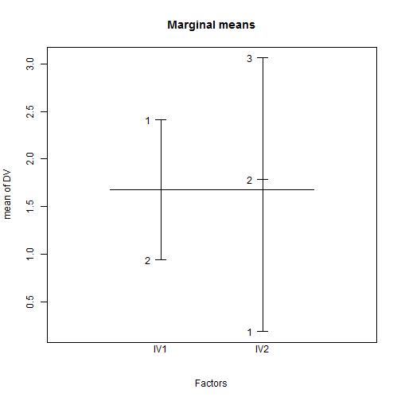
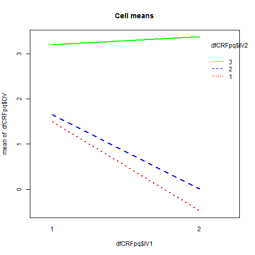
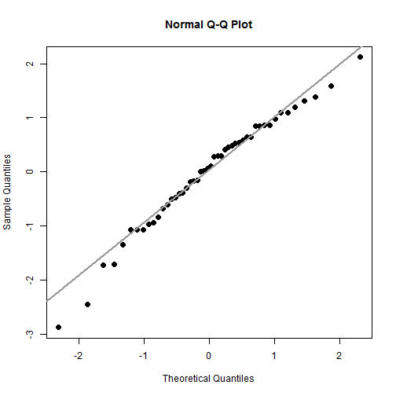
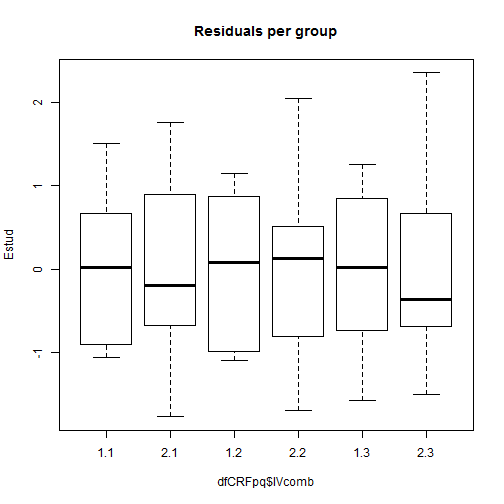

Two-way ANOVA (CRF-pq design)
=========================

TODO
-------------------------

 - link to anovaSStypes, normality, varianceHom, regressionDiag
 - use `model.tables()`

Install required packages
-------------------------

[`car`](http://cran.r-project.org/package=car), [`multcomp`](http://cran.r-project.org/package=multcomp)


```r
wants <- c("car", "multcomp")
has   <- wants %in% rownames(installed.packages())
if(any(!has)) install.packages(wants[!has])
```


CRF-$pq$ ANOVA
-------------------------

### Using `aov()` (SS type I)


```r
set.seed(123)
Njk  <- 8
P    <- 2
Q    <- 3
muJK <- c(rep(c(1, -1), Njk), rep(c(2, 1), Njk), rep(c(3, 3), Njk))
dfCRFpq <- data.frame(IV1=factor(rep(1:P, times=Njk*Q)),
                      IV2=factor(rep(1:Q,  each=Njk*P)),
                      DV =rnorm(Njk*P*Q, muJK, 2))
```


```r
dfCRFpq$IVcomb <- interaction(dfCRFpq$IV1, dfCRFpq$IV2)
```


```r
summary(aov(DV ~ IV1*IV2, data=dfCRFpq))
```

```
            Df Sum Sq Mean Sq F value  Pr(>F)    
IV1          1   15.8    15.8    4.37 0.04264 *  
IV2          2   74.0    37.0   10.26 0.00024 ***
IV1:IV2      2   10.6     5.3    1.47 0.24067    
Residuals   42  151.4     3.6                    
---
Signif. codes:  0 '***' 0.001 '**' 0.01 '*' 0.05 '.' 0.1 ' ' 1 
```


### Using `Anova()` from package `car` (SS type II or III)

Since this design has equal cell sizes, all SS types give the same result.


```r
fitIII <- lm(DV ~ IV1 + IV2 + IV1:IV2, data=dfCRFpq,
             contrasts=list(IV1=contr.sum, IV2=contr.sum))
library(car)
Anova(fitIII, type="III")
```

```
Anova Table (Type III tests)

Response: DV
            Sum Sq Df F value  Pr(>F)    
(Intercept)  114.2  1   31.69 1.4e-06 ***
IV1           15.8  1    4.37 0.04264 *  
IV2           74.0  2   10.26 0.00024 ***
IV1:IV2       10.6  2    1.47 0.24067    
Residuals    151.4 42                    
---
Signif. codes:  0 '***' 0.001 '**' 0.01 '*' 0.05 '.' 0.1 ' ' 1 
```


### Plot marginal and cell means


```r
plot.design(DV ~ IV1*IV2, data=dfCRFpq, main="Marginal means")
```

 

```r
interaction.plot(dfCRFpq$IV1, dfCRFpq$IV2, dfCRFpq$DV,
                 main="Cell means", col=c("red", "blue", "green"), lwd=2)
```

 


Effect size estimate: partial $\hat{\eta}_{p}^{2}$
-------------------------


```r
anRes <- anova(lm(DV ~ IV1*IV2, data=dfCRFpq))
SS1   <- anRes["IV1",       "Sum Sq"]
SS2   <- anRes["IV2",       "Sum Sq"]
SSI   <- anRes["IV1:IV2",   "Sum Sq"]
SSE   <- anRes["Residuals", "Sum Sq"]
```


```r
(pEtaSq1 <- SS1 / (SS1 + SSE))
```

```
[1] 0.09426
```

```r
(pEtaSq2 <- SS2 / (SS2 + SSE))
```

```
[1] 0.3282
```

```r
(pEtaSqI <- SSI / (SSI + SSE))
```

```
[1] 0.06558
```


Or from function `ezANOVA()` from package [`ez`](http://cran.r-project.org/package=ez)

Simple effects
-------------------------


```r
CRFp1 <- anova(lm(DV ~ IV1, data=dfCRFpq, subset=(IV2==1)))
CRFp2 <- anova(lm(DV ~ IV1, data=dfCRFpq, subset=(IV2==2)))
CRFp3 <- anova(lm(DV ~ IV1, data=dfCRFpq, subset=(IV2==3)))
```


```r
SSp1 <- CRFp1["IV1", "Sum Sq"]
SSp2 <- CRFp2["IV1", "Sum Sq"]
SSp3 <- CRFp3["IV1", "Sum Sq"]
```


```r
CRFpq <- anova(lm(DV ~ IV1*IV2, data=dfCRFpq))
SSA   <- CRFpq["IV1",       "Sum Sq"]
SSI   <- CRFpq["IV1:IV2",   "Sum Sq"]
SSE   <- CRFpq["Residuals", "Sum Sq"]
dfSSA <- CRFpq["IV1",       "Df"]
dfSSE <- CRFpq["Residuals", "Df"]
```


```r
all.equal(SSp1 + SSp2 + SSp3, SSA + SSI)
```

```
[1] TRUE
```


```r
Fp1 <- (SSp1/dfSSA) / (SSE/dfSSE)
Fp2 <- (SSp2/dfSSA) / (SSE/dfSSE)
Fp3 <- (SSp3/dfSSA) / (SSE/dfSSE)
```


```r
(pP1 <- 1-pf(Fp1, dfSSA, dfSSE))
```

```
[1] 0.04441
```

```r
(pP2 <- 1-pf(Fp2, dfSSA, dfSSE))
```

```
[1] 0.09105
```

```r
(pP3 <- 1-pf(Fp3, dfSSA, dfSSE))
```

```
[1] 0.8575
```


Planned comparisons
-------------------------

### Main effects only

#### Free comparisons of marginal means


```r
aovCRFpq <- aov(DV ~ IV1*IV2, data=dfCRFpq)
cMat     <- rbind("c1"=c( 1/2, 1/2, -1),
                  "c2"=c(  -1,   0,  1))

library(multcomp)
summary(glht(aovCRFpq, linfct=mcp(IV2=cMat), alternative="two.sided"),
        test=adjusted("bonferroni"))
```

```

	 Simultaneous Tests for General Linear Hypotheses

Multiple Comparisons of Means: User-defined Contrasts


Fit: aov(formula = DV ~ IV1 * IV2, data = dfCRFpq)

Linear Hypotheses:
        Estimate Std. Error t value Pr(>|t|)
c1 == 0   -1.630      0.822   -1.98     0.11
c2 == 0    1.710      0.949    1.80     0.16
(Adjusted p values reported -- bonferroni method)
```


#### Tukey simultaneous confidence intervals


```r
TukeyHSD(aovCRFpq, which="IV2")
```

```
  Tukey multiple comparisons of means
    95% family-wise confidence level

Fit: aov(formula = DV ~ IV1 * IV2, data = dfCRFpq)

$IV2
      diff     lwr   upr  p adj
2-1 0.3216 -1.3091 1.952 0.8815
3-1 2.7791  1.1483 4.410 0.0005
3-2 2.4575  0.8267 4.088 0.0020
```


### Cell comparisons using the associated one-way ANOVA


```r
(aovCRFpqA <- aov(DV ~ IVcomb, data=dfCRFpq))
```

```
Call:
   aov(formula = DV ~ IVcomb, data = dfCRFpq)

Terms:
                IVcomb Residuals
Sum of Squares   100.3     151.4
Deg. of Freedom      5        42

Residual standard error: 1.899 
Estimated effects may be unbalanced
```

```r
cntrMat <- rbind("c1"=c(-1/2,  1/4, -1/2, 1/4, 1/4, 1/4),
                 "c2"=c(   0,    0,   -1,   0,   1,   0),
                 "c3"=c(-1/2, -1/2,  1/4, 1/4, 1/4, 1/4))
```


```r
library(multcomp)
summary(glht(aovCRFpqA, linfct=mcp(IVcomb=cntrMat), alternative="greater"),
        test=adjusted("none"))
```

```

	 Simultaneous Tests for General Linear Hypotheses

Multiple Comparisons of Means: User-defined Contrasts


Fit: aov(formula = DV ~ IVcomb, data = dfCRFpq)

Linear Hypotheses:
        Estimate Std. Error t value Pr(>t)   
c1 <= 0  -0.0442     0.5813   -0.08 0.5301   
c2 <= 0   1.5508     0.9493    1.63 0.0549 . 
c3 <= 0   1.5503     0.5813    2.67 0.0054 **
---
Signif. codes:  0 '***' 0.001 '**' 0.01 '*' 0.05 '.' 0.1 ' ' 1 
(Adjusted p values reported -- none method)
```


Assess test assumptions
-------------------------

### Normality


```r
Estud <- rstudent(aovCRFpq)
qqnorm(Estud, pch=20, cex=2)
qqline(Estud, col="gray60", lwd=2)
```

 


```r
shapiro.test(Estud)
```

```

	Shapiro-Wilk normality test

data:  Estud 
W = 0.9771, p-value = 0.4655
```


### Variance homogeneity


```r
plot(Estud ~ dfCRFpq$IVcomb, main="Residuals per group")
```

 


```r
library(car)
leveneTest(aovCRFpq)
```

```
Levene's Test for Homogeneity of Variance (center = median)
      Df F value Pr(>F)
group  5    0.05      1
      42               
```


Detach (automatically) loaded packages (if possible)
-------------------------


```r
try(detach(package:car))
try(detach(package:nnet))
try(detach(package:MASS))
try(detach(package:multcomp))
try(detach(package:survival))
try(detach(package:mvtnorm))
try(detach(package:splines))
```


Get the article source from GitHub
----------------------------------------------

[R markdown](https://github.com/dwoll/RExRepos/raw/master/Rmd/anovaCRFpq.Rmd) - [markdown](https://github.com/dwoll/RExRepos/raw/master/md/anovaCRFpq.md) - [R code](https://github.com/dwoll/RExRepos/raw/master/R/anovaCRFpq.R) - [all posts](https://github.com/dwoll/RExRepos/)
