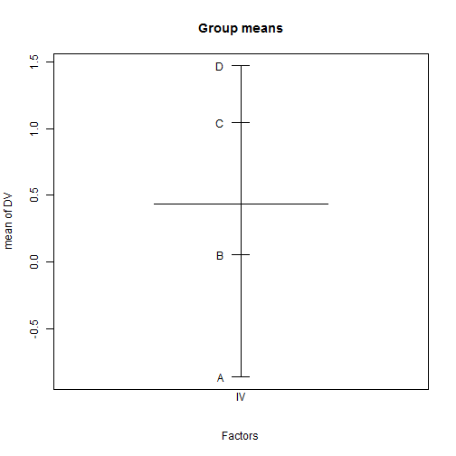
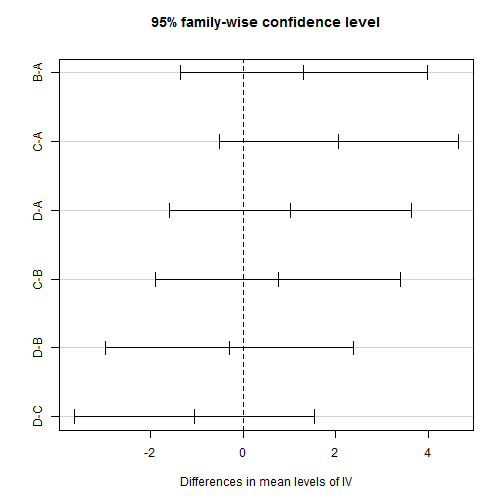
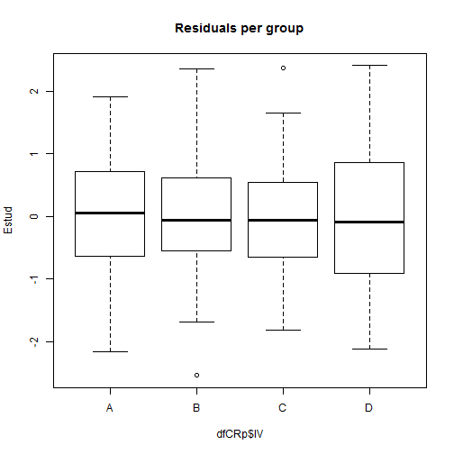

TODO
-------------------------

 - link to normality, varianceHom, regressionDiag, regression for model comparison, resamplingPerm, resamplingBootALM

Install required packages
-------------------------

[`car`](http://cran.r-project.org/package=car), [`multcomp`](http://cran.r-project.org/package=multcomp)


```r
wants <- c("car", "multcomp")
has   <- wants %in% rownames(installed.packages())
if(any(!has)) install.packages(wants[!has])
```


CR-$p$ ANOVA
-------------------------

### Simulate data


```r
set.seed(1.234)
P     <- 4
Nj    <- c(41, 37, 42, 40)
muJ   <- rep(c(-1, 0, 1, 2), Nj)
dfCRp <- data.frame(IV=factor(rep(LETTERS[1:P], Nj)),
                    DV=rnorm(sum(Nj), muJ, 5))
```


```r
plot.design(DV ~ IV, fun=mean, data=dfCRp, main="Group means")
```

 


### Using `oneway.test()`

#### Assuming variance homogeneity


```r
oneway.test(DV ~ IV, data=dfCRp, var.equal=TRUE)
```

```

	One-way analysis of means

data:  DV and IV 
F = 1.477, num df = 3, denom df = 156, p-value = 0.223
```


#### Generalized Welch-test without assumption of variance homogeneity


```r
oneway.test(DV ~ IV, data=dfCRp, var.equal=FALSE)
```

```

	One-way analysis of means (not assuming equal variances)

data:  DV and IV 
F = 1.607, num df = 3.00, denom df = 85.85, p-value = 0.1938
```


### Using `aov()`


```r
aovCRp <- aov(DV ~ IV, data=dfCRp)
summary(aovCRp)
```

```
             Df Sum Sq Mean Sq F value Pr(>F)
IV            3     91    30.2    1.48   0.22
Residuals   156   3196    20.5               
```

```r
model.tables(aovCRp, type="means")
```

```
Tables of means
Grand mean
       
0.5297 

 IV 
          A       B      C      D
    -0.5712  0.7419  1.495  0.448
rep 41.0000 37.0000 42.000 40.000
```


### Model comparisons using `anova(lm())`


```r
(anovaCRp <- anova(lm(DV ~ IV, data=dfCRp)))
```

```
Analysis of Variance Table

Response: DV
           Df Sum Sq Mean Sq F value Pr(>F)
IV          3     91    30.2    1.48   0.22
Residuals 156   3196    20.5               
```


```r
anova(lm(DV ~ 1, data=dfCRp), lm(DV ~ IV, data=dfCRp))
```

```
Analysis of Variance Table

Model 1: DV ~ 1
Model 2: DV ~ IV
  Res.Df  RSS Df Sum of Sq    F Pr(>F)
1    159 3287                         
2    156 3196  3      90.8 1.48   0.22
```


```r
anovaCRp["Residuals", "Sum Sq"]
```

```
[1] 3196
```


Effect size estimates
-------------------------


```r
dfSSb <- anovaCRp["IV",        "Df"]
SSb   <- anovaCRp["IV",        "Sum Sq"]
MSb   <- anovaCRp["IV",        "Mean Sq"]
SSw   <- anovaCRp["Residuals", "Sum Sq"]
MSw   <- anovaCRp["Residuals", "Mean Sq"]
```


```r
(etaSq <- SSb / (SSb + SSw))
```

```
[1] 0.02761
```

```r
(omegaSq <- dfSSb * (MSb-MSw) / (SSb + SSw + MSw))
```

```
[1] 0.00886
```

```r
(f <- sqrt(etaSq / (1-etaSq)))
```

```
[1] 0.1685
```


Or from function `ezANOVA()` from package [`ez`](http://cran.r-project.org/package=ez)

Planned comparisons
-------------------------

### General contrasts using `glht()` from package `multcomp`


```r
cntrMat <- rbind("A-D"          =c(  1,   0,   0,  -1),
                 "1/3*(A+B+C)-D"=c(1/3, 1/3, 1/3,  -1),
                 "B-C"          =c(  0,   1,  -1,   0))
library(multcomp)
summary(glht(aovCRp, linfct=mcp(IV=cntrMat), alternative="less"),
        test=adjusted("none"))
```

```

	 Simultaneous Tests for General Linear Hypotheses

Multiple Comparisons of Means: User-defined Contrasts


Fit: aov(formula = DV ~ IV, data = dfCRp)

Linear Hypotheses:
                   Estimate Std. Error t value Pr(<t)
A-D >= 0             -1.019      1.006   -1.01   0.16
1/3*(A+B+C)-D >= 0    0.107      0.827    0.13   0.55
B-C >= 0             -0.753      1.021   -0.74   0.23
(Adjusted p values reported -- none method)
```


### Pairwise $t$-tests


```r
pairwise.t.test(dfCRp$DV, dfCRp$IV, p.adjust.method="bonferroni")
```

```

	Pairwise comparisons using t tests with pooled SD 

data:  dfCRp$DV and dfCRp$IV 

  A    B    C   
B 1.00 -    -   
C 0.24 1.00 -   
D 1.00 1.00 1.00

P value adjustment method: bonferroni 
```


### Tukey's simultaneous confidence intervals


```r
(tHSD <- TukeyHSD(aovCRp))
```

```
  Tukey multiple comparisons of means
    95% family-wise confidence level

Fit: aov(formula = DV ~ IV, data = dfCRp)

$IV
       diff     lwr   upr  p adj
B-A  1.3131 -1.3522 3.978 0.5774
C-A  2.0662 -0.5144 4.647 0.1644
D-A  1.0192 -1.5931 3.631 0.7420
C-B  0.7531 -1.8971 3.403 0.8816
D-B -0.2939 -2.9750 2.387 0.9919
D-C -1.0470 -3.6439 1.550 0.7220
```


```r
plot(tHSD)
```

 


Assess test assumptions
-------------------------

### Normality


```r
Estud <- rstudent(aovCRp)
qqnorm(Estud, pch=20, cex=2)
qqline(Estud, col="gray60", lwd=2)
```

 


```r
shapiro.test(Estud)
```

```

	Shapiro-Wilk normality test

data:  Estud 
W = 0.9945, p-value = 0.8079
```


### Variance homogeneity


```r
plot(Estud ~ dfCRp$IV, main="Residuals per group")
```

 


```r
library(car)
leveneTest(aovCRp)
```

```
Levene's Test for Homogeneity of Variance (center = median)
       Df F value Pr(>F)
group   3    0.08   0.97
      156               
```


Detach (automatically) loaded packages (if possible)
-------------------------


```r
try(detach(package:car))
try(detach(package:nnet))
try(detach(package:MASS))
try(detach(package:multcomp))
try(detach(package:survival))
try(detach(package:mvtnorm))
try(detach(package:splines))
```


Get the article source from GitHub
----------------------------------------------

[R markdown](https://github.com/dwoll/RExRepos/raw/master/Rmd/anovaCRp.Rmd) - [markdown](https://github.com/dwoll/RExRepos/raw/master/md/anovaCRp.md) - [R code](https://github.com/dwoll/RExRepos/raw/master/R/anovaCRp.R) - [all posts](https://github.com/dwoll/RExRepos/)
