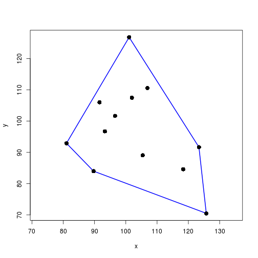
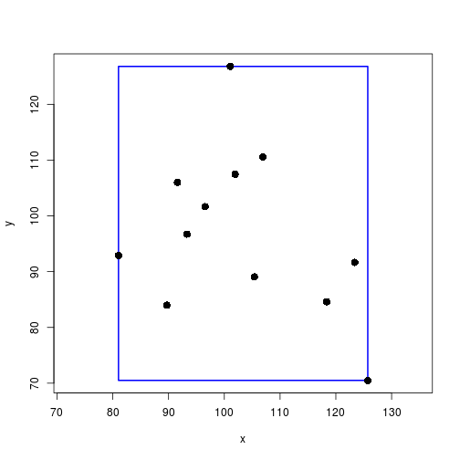
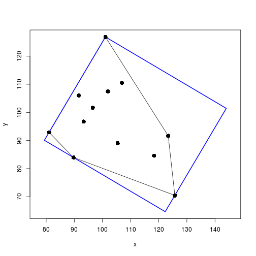
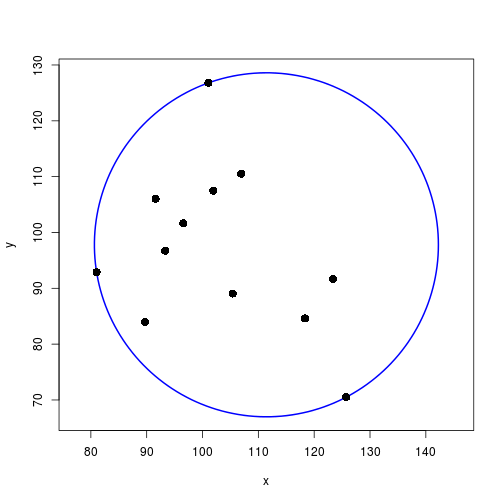

Convex hull, (minimum) bounding box, and minimum enclosing circle
=========================
 
Convex hull
-------------------------

`chull()` returns the ordered indices of the matrix rows corresponding to corners of the convex hull.


```r
set.seed(123)
xy      <- matrix(rnorm(24, 100, 15), ncol=2)
hullIdx <- chull(xy)
```


```r
plot(xy, xlab="x", ylab="y", asp=1, type="n")
polygon(xy[hullIdx, ], border="blue", lwd=2)
points(xy, pch=16, cex=1.5)
```

 

Bounding box
-------------------------


```r
getBoundingBox <- function(xy) {
    stopifnot(is.matrix(xy), is.numeric(xy), ncol(xy) == 2)
    x   <- range(xy[ , 1])
    y   <- range(xy[ , 2])
    pts <- c(xleft=x[1], ybottom=y[1], xright=x[2], ytop=y[2])
    return(list(pts=pts, width=abs(diff(x)), height=abs(diff(y))))
}
```


```r
bb <- getBoundingBox(xy)
plot(xy, xlab="x", ylab="y", asp=1, type="n")
rect(bb$pts[1], bb$pts[2], bb$pts[3], bb$pts[4], border="blue", lwd="2")
points(xy, pch=16, cex=1.5)
```

 


```r
bb$width * bb$height
```

```
[1] 2516.849
```

Minimum bounding box
-------------------------

### Rotating calipers algorithm


```r
getMinBBox <- function(xy) {
    stopifnot(is.matrix(xy), is.numeric(xy), nrow(xy) >= 2, ncol(xy) == 2)

    ## rotating calipers algorithm using the convex hull
    H    <- chull(xy)                    # hull indices, vertices ordered clockwise
    n    <- length(H)                    # number of hull vertices
    hull <- xy[H, ]                      # hull vertices

    ## unit basis vectors for all subspaces spanned by the hull edges
    hDir  <- diff(rbind(hull, hull[1,])) # account for circular hull vertices
    hLens <- sqrt(rowSums(hDir^2))       # length of basis vectors
    huDir <- diag(1/hLens) %*% hDir      # scaled to unit length

    ## unit basis vectors for the orthogonal subspaces
    ## rotation by 90 deg -> y' = x, x' = -y
    ouDir <- cbind(-huDir[ , 2], huDir[ , 1])

    ## project hull vertices on the subspaces spanned by the hull edges, and on
    ## the subspaces spanned by their orthogonal complements - in subspace coords
    projMat <- rbind(huDir, ouDir) %*% t(hull)

    ## range of projections and corresponding width/height of bounding rectangle
    rangeH  <- matrix(numeric(n*2), ncol=2)   # hull edge
    rangeO  <- matrix(numeric(n*2), ncol=2)   # orth subspace
    widths  <- numeric(n)
    heights <- numeric(n)
    for(i in seq(along=H)) {
        rangeH[i, ] <- range(projMat[  i, ])
        rangeO[i, ] <- range(projMat[n+i, ])  # orth subspace is in 2nd half
        widths[i]   <- abs(diff(rangeH[i, ]))
        heights[i]  <- abs(diff(rangeO[i, ]))
    }

    ## extreme projections for min-area rect in subspace coordinates
    eMin  <- which.min(widths*heights)   # hull edge leading to minimum-area
    hProj <- rbind(   rangeH[eMin, ], 0)
    oProj <- rbind(0, rangeO[eMin, ])

    ## move projections to rectangle corners
    hPts <- sweep(hProj, 1, oProj[ , 1], "+")
    oPts <- sweep(hProj, 1, oProj[ , 2], "+")

    ## corners in standard coordinates, rows = x,y, columns = corners
    ## in combined (4x2)-matrix: reverse point order to be usable in polygon()
    basis <- cbind(huDir[eMin, ], ouDir[eMin, ])  # basis formed by hull edge and orth
    hCorn <- basis %*% hPts
    oCorn <- basis %*% oPts
    pts   <- t(cbind(hCorn, oCorn[ , c(2, 1)]))

    return(list(pts=pts, width=widths[eMin], height=heights[eMin]))
}
```

### Draw the minimum bounding box


```r
mbb <- getMinBBox(xy)       ## minimum bounding box
H   <- chull(xy)            ## convex hull

# plot original points, convex hull, and minimum bounding box
plot(xy, xlab="x", ylab="y", asp=1, type="n",
         xlim=range(c(xy[ , 1], mbb$pts[ , 1])),
         ylim=range(c(xy[ , 2], mbb$pts[ , 2])))
polygon(xy[H, ], col=NA)    ## show convex hull
polygon(mbb$pts, border="blue", lwd=2)
points(xy, pch=16, cex=1.5)
```

 


```r
mbb$width * mbb$height      ## box area
```

```
[1] 2127.255
```

Minimum enclosing circle
-------------------------

Skyum algorithm based on the convex hull

### Circle defined by three points


```r
getCircleFrom3 <- function(xy) {
    stopifnot(is.matrix(xy), is.numeric(xy), nrow(xy) == 3, ncol(xy) == 2)

    aa <- xy[1,  ]
    bb <- xy[2,  ]
    cc <- xy[3,  ]
    y  <- xy[ , 2]

    xDeltaA <- bb[1] - aa[1]
    yDeltaA <- bb[2] - aa[2]
    xDeltaB <- cc[1] - bb[1]
    yDeltaB <- cc[2] - bb[2]
    xDeltaC <- cc[1] - aa[1]
    yDeltaC <- cc[2] - aa[2]

    ## check if the points are collinear: qr(xy)$rank == 1, or:
    ## determinant of difference matrix = 0, no need to use det()
    dMat <- rbind(c(xDeltaA, yDeltaA), c(xDeltaB, yDeltaB))
    if(isTRUE(all.equal(dMat[1,1]*dMat[2,2] - dMat[1,2]*dMat[2,1], 0, check.attributes=FALSE))) {
        ## define the circle as the one that's centered between the points
        rangeX <- range(c(aa[1], bb[1], cc[1]))
        rangeY <- range(c(aa[2], bb[2], cc[2]))
        ctr    <- c(rangeX[1] + 0.5*diff(rangeX), rangeY[1] + 0.5*diff(rangeY))
        rad    <- sqrt((0.5*diff(rangeX))^2 + (0.5*diff(rangeY))^2)
    } else {
        rad <- prod(dist(xy)) / (2 * abs(det(cbind(xy, 1))))  # circle radius
        v1  <- rowSums(xy^2)                    # first vector in the numerator
        v2x <- c( xDeltaB, -xDeltaC,  xDeltaA)  # 2nd vector numerator for Mx
        v2y <- c(-yDeltaB,  yDeltaC, -yDeltaA)  # 2nd vector numerator for My
        ctr <- c(t(v1) %*% v2y, t(v1) %*% v2x) / (2 * (t(y) %*% v2x))  # center
    }

    return(list(ctr=ctr, rad=rad))
}
```

### Vertex that produces the circle with the maximum radius

Used later in `getMinCircle()`


```r
getMaxRad <- function(xy, S) {
    stopifnot(is.matrix(xy), is.numeric(xy), nrow(xy) >= 2, ncol(xy) == 2)
    stopifnot(is.numeric(S), length(S) >= 2, length(S) <= nrow(xy))

    n    <- length(S)                    # number of points
    Sidx <- seq(along=S)                 # index for points
    rads <- numeric(n)                   # radii for all circles
    post <- (Sidx %% n) + 1              # next point in S
    prev <- Sidx[order(post)]            # previous point in S
    for(i in Sidx) {
        pts     <- rbind(xy[S[prev[i]], ], xy[S[i], ], xy[S[post[i]], ])
        rads[i] <- getCircleFrom3(pts)$rad  # circle radius
    }

    return(which.max(rads))
}
```

### Check if the angle at B in triangle ABC exceeds 90 degrees


```r
isBiggerThan90 <- function(xy) {
    stopifnot(is.matrix(xy), is.numeric(xy), nrow(xy) == 3, ncol(xy) == 2)
    d   <- dist(xy)
    dAB <- d[1]
    dAC <- d[2]
    dBC <- d[3]
    return((dAB^2 + dBC^2 - dAC^2) < 0)
}
```

### Maximum pairwise distance between two 2D-points


```r
getMaxPairDist <- function(xy) {
    stopifnot(is.matrix(xy), is.numeric(xy), ncol(xy) == 2, nrow(xy) >= 2)

    # 2D -> only convex hull is relevant
    H    <- chull(xy)      # convex hull indices (vertices ordered clockwise)
    pts  <- xy[H, ]        # points that make up the convex hull
    N    <- nrow(pts)                      # number of points on hull
    dMat <- dist(pts, method="euclidean")  # distance matrix
    idx  <- which.max(as.matrix(dMat))     # maximum distance
    i    <- (idx-1) %/% N+1                # column -> point 1
    j    <- (idx-1) %%  N+1                # row    -> point 2
    mPts <- H[c(i, j)]                     # rows with max distance
    dst  <- max(dMat)                      # max distance

    return(list(d=dst, idx=mPts))
}
```

### Minimal enclosing circle


```r
getMinCircle <- function(xy) {
    stopifnot(is.matrix(xy), is.numeric(xy), nrow(xy) >= 2, ncol(xy) == 2)

    H    <- chull(xy)      # convex hull indices (vertices ordered clockwise)
    hPts <- xy[H, ]        # points that make up the convex hull

    ## min circle may touch convex hull in only two points
    ## if so, it is centered between the hull points with max distance
    maxPD  <- getMaxPairDist(hPts)
    idx    <- maxPD$idx    # index of points with max distance
    rad    <- maxPD$d / 2  # half the distance -> radius
    rangeX <- c(hPts[idx[1], 1], hPts[idx[2], 1])
    rangeY <- c(hPts[idx[1], 2], hPts[idx[2], 2])
    ctr    <- c(rangeX[1] + 0.5*diff(rangeX), rangeY[1] + 0.5*diff(rangeY))

    ## check if circle centered between hPts[pt1Idx, ] and hPts[pt2Idx, ]
    ## contains all points (all distances <= rad)
    dst2ctr <- dist(rbind(ctr, hPts[-idx, ]))      # distances to center
    if(all(as.matrix(dst2ctr)[-1, 1] <= rad)) {    # if all <= rad, we're done
        tri <- rbind(hPts[idx, ], ctr)
        return(getCircleFrom3(tri))
    }

    ## min circle touches hull in three points - Skyum algorithm
    S <- H                               # copy of hull indices that will be changed
    while(length(S) >= 2) {
        n    <- length(S)                # number of remaining hull vertices
        Sidx <- seq(along=S)             # index for vertices
        post <- (Sidx %% n) + 1          # next vertex in S
        prev <- Sidx[order(post)]        # previous vertex in S
        mIdx <- getMaxRad(xy, S)         # idx for maximum radius

        ## triangle where mIdx is vertex B in ABC
        Smax <- rbind(xy[S[prev[mIdx]], ], xy[S[mIdx], ], xy[S[post[mIdx]], ])

        ## if there's only two hull vertices, we're done
        if(n <= 2) { break }

        ## check if angle(ABC) is > 90
        ## if so, eliminate B - if not, we're done
        if(isBiggerThan90(Smax)) { S <- S[-mIdx] } else { break }
    }

    return(getCircleFrom3(Smax))
}
```

### Draw the minimal enclosing circle


```r
mc     <- getMinCircle(xy)
angles <- seq(0, 2*pi, length.out=200)
circ   <- cbind(mc$ctr[1] + mc$rad*cos(angles),
                mc$ctr[2] + mc$rad*sin(angles))

# determine axis limits so that the circle will be visible
xLims <- mc$ctr[1] + c(-mc$rad, mc$rad)
yLims <- mc$ctr[2] + c(-mc$rad, mc$rad)
plot(xy, xlab="x", ylab="y", xlim=xLims, ylim=yLims, asp=1, type="n")
lines(circ, col="blue", lwd=2)
points(xy, pch=16, cex=1.5)
```

 


Get the article source from GitHub
----------------------------------------------

[R markdown](https://github.com/dwoll/RExRepos/raw/master/Rmd/diagBounding.Rmd) - [markdown](https://github.com/dwoll/RExRepos/raw/master/md/diagBounding.md) - [R code](https://github.com/dwoll/RExRepos/raw/master/R/diagBounding.R) - [all posts](https://github.com/dwoll/RExRepos/)
