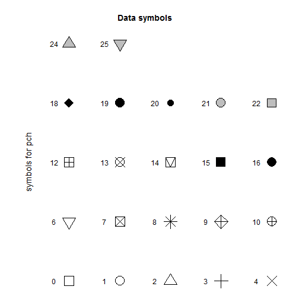
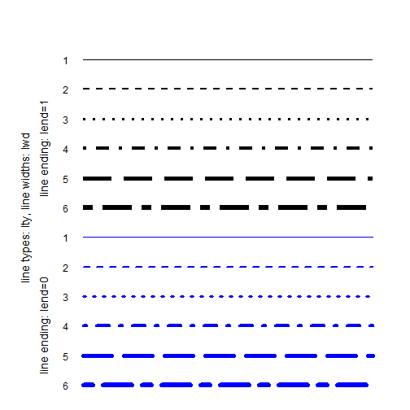
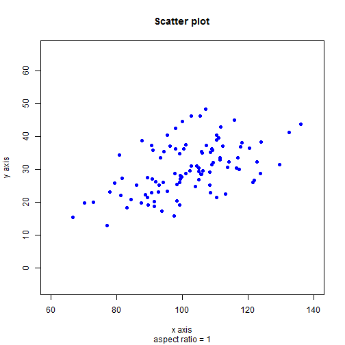
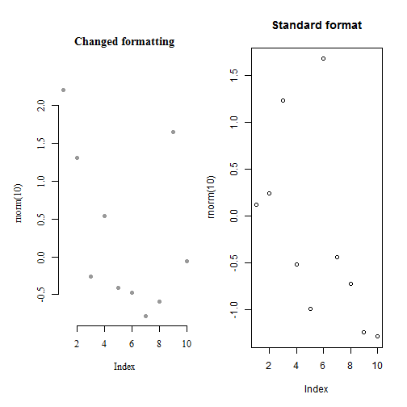
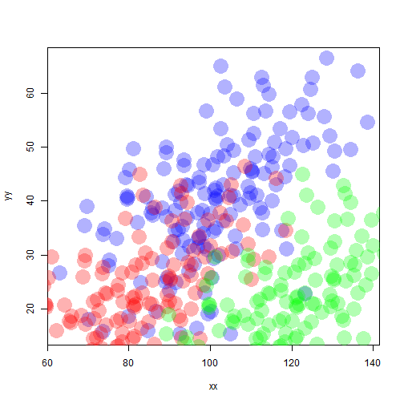
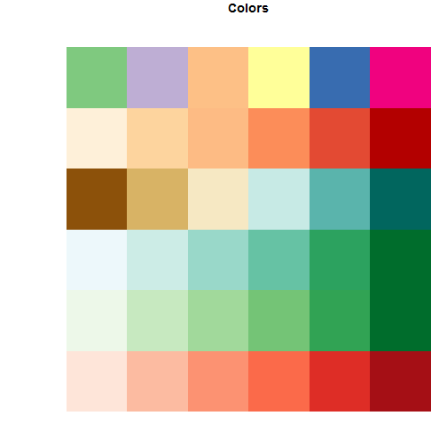

TODO
-------------------------

 - link to diagAddElements -> `axis()`, diagMultiple

Install required packages
-------------------------

[`RColorBrewer`](http://cran.r-project.org/package=RColorBrewer)


```r
wants <- c("RColorBrewer")
has   <- wants %in% rownames(installed.packages())
if(any(!has)) install.packages(wants[!has])
```


Formatting elements for all kinds of diagrams
-------------------------

Nearly all R base diagrams come with a shared set of options to control typical diagram elements like the title, axis labels and limits, or the type of plot symbol. They are illustrated here using the `plot()` function for simple scatter plots.

### Plot symbols and line types

Plot symbols are chosen with option `pch`.


```r
X <- row(matrix(numeric(6*5), nrow=6, ncol=5))
Y <- col(matrix(numeric(6*5), nrow=6, ncol=5))

par(mar=c(1, 1, 4, 2))
plot(0:5, seq(1, 5, length.out=6), type="n", xlab=NA, ylab=NA,
     axes=FALSE, main="Data symbols")
points(X[1:26], Y[1:26], pch=0:25, bg="gray", cex=3)
text(X[1:26]-0.3, Y[1:26], labels=0:25)
text(0.2, 3, labels="symbols for pch", srt=90, cex=1.2)
```

 


Line types are chosen with option `lty`, line widths with option `lwd`, and round vs. square line ends with `lend`.


```r
X <- row(matrix(numeric(6*12), nrow=6, ncol=12))
Y <- col(matrix(numeric(6*12), nrow=6, ncol=12))

par(mar=c(1, 1, 4, 2))
plot(0:6, seq(1, 12, length.out=7), type="n", axes=FALSE)
matlines(X[ , 1:6],  Y[ , 1:6],  lty=6:1, lwd=6:1, lend=0, col="blue")
matlines(X[ , 7:12], Y[ , 7:12], lty=6:1, lwd=6:1, lend=1, col="black")

## add annotations
text(rep(0.7, 12), Y[1, 1:12], labels=c(6:1, 6:1))
text(0, 7, labels="line types: lty, line widths: lwd", srt=90, cex=1.2)
text(0.32, 9, labels="line ending: lend=1", srt=90, cex=1.2)
text(0.32, 3, labels="line ending: lend=0", srt=90, cex=1.2)
```

 


### Diagram title, axis labels, axis limits, aspect ratio


```r
set.seed(1.234)
N <- 100
x <- rnorm(N, 100, 15)
y <- 0.3*x + rnorm(N, 0, 7)
plot(x, y, main="Scatter plot", sub="aspect ratio = 1",
     xlab="x axis", ylab="y axis",
     xlim=c(60, 140), asp=1, pch=16, col="blue")
```

 


Setting parameters with `par()`
-------------------------

Formatting details of a diagram can also be controlled with a call to `par()` before a diagram is opened. Some aspects can be set both with `par()`, and with the diagram function - e.g., with options to `plot()`. These include (see `?par` for explanations):

 - `cex`, `cex.axis`, `cex.main`, `cex.lab` for the size of plot symbols, axis labels and diagram title
 - `col` for the color of plot symbols
 - `font`, `family` for the font of the diagram annotations
 - `las` for the orientation of axis labels
 - `lend`, `lty`, `lwd`, `pch` for the style of lines and plot symbols
 - `xaxs`, `yaxs` for the precise axis limits
 - `xaxt`, `yaxt` for the presence of axes

Other aspects can only be set in `par()`. These include: `bt`, `mar`, `oma`, `xlog`, `ylog`. The return value of `par()` is a list with the old value for the changed option. When it is saved, it can later be passed as an option to `par()` to reset the option for the current graphics device to its previous value.


```r
par(mfrow=c(1, 2))
op <- par(col="gray60", family="serif", bty="n", mar=c(7, 5, 7, 1), pch=16)
plot(rnorm(10), main="Changed formatting")
par(op)
plot(rnorm(10), main="Standard format")
```

 


Colors
-------------------------

### Default palette and other palette choices


```r
N <- 6
(colDef <- palette()[1:N])
```

```
[1] "black"   "red"     "green3"  "blue"    "cyan"    "magenta"
```

```r
(colAll <- sample(colors(), N, replace=FALSE))
```

```
[1] "blue2"     "gray40"    "grey68"    "lightblue" "gray20"    "grey15"   
```


```r
colRain <- rainbow(N)
colTopo <- topo.colors(N)
colCm   <- cm.colors(N)
colHeat <- heat.colors(N)
```


```r
len    <- 1/N
xLeft  <- rep(seq(0,   1-len, by=len), times=N)
yBot   <- rep(seq(0,   1-len, by=len),  each=N)
xRight <- rep(seq(len, 1,     by=len), times=N)
yTop   <- rep(seq(len, 1,     by=len),  each=N)

par(mar=c(0, 4, 1, 0) + 0.1)
plot(c(0, 1), c(0, 1), axes=FALSE, xlab=NA, ylab=NA, type="n",
     asp=1, main="Colors")
rect(xLeft, yBot, xRight, yTop, border=NA,
     col=c(colDef, colAll, colRain, colTopo, colCm, colHeat))
par(xpd=NA)
text(-0.05, seq(0, 1-len, length.out=N) + len/2, adj=1,
     labels=c("default", "sample", "rainbow", "topo", "cm", "heat"))
```

 


### RGB colors and transparency


```r
rgb(0, 1, 1)
```

```
[1] "#00FFFF"
```

```r
rgb(t(col2rgb("red")/255))
```

```
[1] "#FF0000"
```


```r
rgb(1, 0, 0, 0.5)
```

```
[1] "#FF000080"
```


```r
N  <- 150
xx <- rnorm(N, 100, 15)
yy <- 0.4*xx + rnorm(N, 0, 10)
plot(xx, yy, pch=16, cex=3.5, col=rgb(0, 0, 1, 0.3))
points(xx-20, yy-20, pch=16, cex=3.5, col=rgb(1, 0, 0, 0.3))
points(xx+20, yy-20, pch=16, cex=3.5, col=rgb(0, 1, 0, 0.3))
```

 


### Other color spaces


```r
hsv(0.1666, 1, 1)
```

```
[1] "#FFFF00"
```

```r
rgb2hsv(matrix(c(0, 1, 1), nrow=3))
```

```
      [,1]
h 0.500000
s 1.000000
v 0.003922
```

```r
hcl(h=120, c=35, l=85)
```

```
[1] "#BBDEB1"
```

```r
gray(0.5)
```

```
[1] "#808080"
```


### Color palettes with `RColorBrewer`


```r
N <- 6
library(RColorBrewer)
(bPal <- brewer.pal(N, "Blues"))
```

```
[1] "#EFF3FF" "#C6DBEF" "#9ECAE1" "#6BAED6" "#3182BD" "#08519C"
```

```r
colorRampPalette(bPal)(15)
```

```
 [1] "#EFF3FF" "#E0EAF9" "#D1E1F3" "#C3D9EE" "#B4D3E9" "#A6CDE3" "#96C6DF"
 [8] "#84BCDB" "#72B2D7" "#5EA4D0" "#4994C7" "#3585BE" "#2574B3" "#1662A7"
[15] "#08519C"
```


```r
b1 <- colorRampPalette(brewer.pal(N, "Reds"))(N)
b2 <- colorRampPalette(brewer.pal(N, "Greens"))(N)
b3 <- colorRampPalette(brewer.pal(N, "BuGn"))(N)
b4 <- colorRampPalette(brewer.pal(N, "BrBG"))(N)
b5 <- colorRampPalette(brewer.pal(N, "OrRd"))(N)
b6 <- colorRampPalette(brewer.pal(N, "Accent"))(N)

len    <- 1/N
xLeft  <- rep(seq(0,   1-len, by=len), times=N)
yBot   <- rep(seq(0,   1-len, by=len),  each=N)
xRight <- rep(seq(len, 1,     by=len), times=N)
yTop   <- rep(seq(len, 1,     by=len),  each=N)

par(mar=c(0, 4, 1, 0) + 0.1)
plot(c(0, 1), c(0, 1), axes=FALSE, xlab=NA, ylab=NA, type="n",
     asp=1, main="Colors")
rect(xLeft, yBot, xRight, yTop, border=NA,
     col=c(b1, b2, b3, b4, b5, b6))
```

 


Useful packages
-------------------------

Package [`colorspace`](http://cran.r-project.org/package=colorspace) provides more functions for converting between different color spaces. The [R color chart](http://research.stowers-institute.org/efg/R/Color/Chart/) gives a very nice overview of colors available in R.

Detach (automatically) loaded packages (if possible)
-------------------------


```r
try(detach(package:RColorBrewer))
```


Get the article source from GitHub
----------------------------------------------

[R markdown](https://github.com/dwoll/RExRepos/raw/master/Rmd/diagFormat.Rmd) - [markdown](https://github.com/dwoll/RExRepos/raw/master/md/diagFormat.md) - [R code](https://github.com/dwoll/RExRepos/raw/master/R/diagFormat.R) - [all posts](https://github.com/dwoll/RExRepos/)
