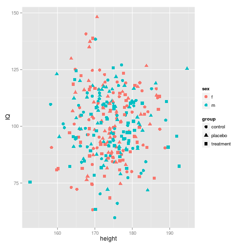
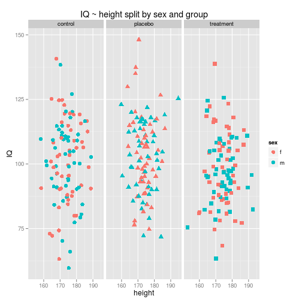
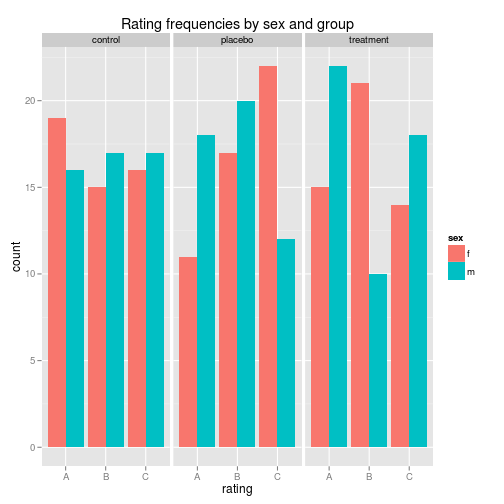
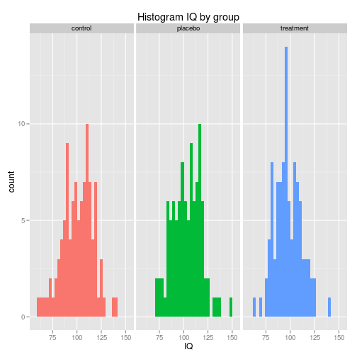
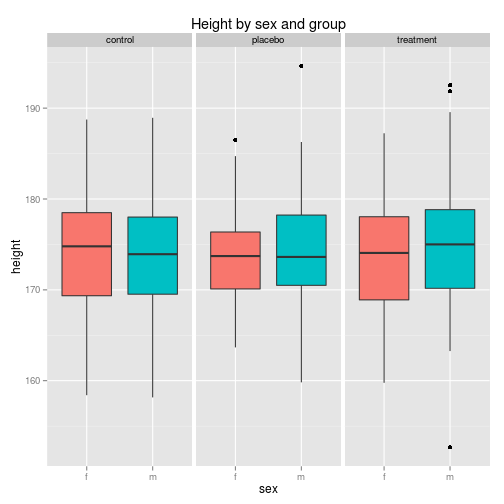
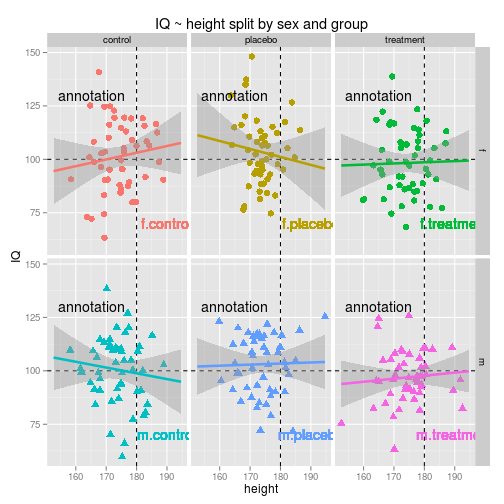

Diagrams with the `ggplot2` package
=========================

Install required packages
-------------------------

[`ggplot2`](http://cran.r-project.org/package=ggplot2)


```r
wants <- c("ggplot2")
has   <- wants %in% rownames(installed.packages())
if(any(!has)) install.packages(wants[!has])
```

Different diagram types
-------------------------

### Simulate data

Data needs to be in long format.


```r
Njk    <- 50
P      <- 3
Q      <- 2
IQ     <- rnorm(P*Q*Njk, mean=100, sd=15)
height <- rnorm(P*Q*Njk, mean=175, sd=7)
rating <- sample(LETTERS[1:3], Njk*P*Q, replace=TRUE)
sex    <- factor(rep(c("f", "m"), times=P*Njk))
group  <- factor(rep(c("control", "placebo", "treatment"), each=Q*Njk))
sgComb <- interaction(sex, group)
myDf   <- data.frame(sex, group, sgComb, IQ, height, rating)
```

### Scatterplot

Add a `geom_point()` layer.


```r
library(ggplot2)
pA1 <- ggplot(myDf, aes(x=height, y=IQ, colour=sex, shape=group))
pA2 <- pA1 + geom_point(size=3)
print(pA2)
```

 

Split the diagram into panels using `facet_grid()`.


```r
pA3 <- pA2 + facet_grid(. ~ group)
pA4 <- pA3 + ggtitle("IQ ~ height split by sex and group")
pA5 <- pA4 + guides(shape=FALSE)
print(pA5)
```

 

### Barplot

Add a `geom_bar()` layer.


```r
pB1 <- ggplot(myDf, aes(x=rating, group=sex, fill=sex))
pB2 <- pB1 + geom_bar(stat="bin", position=position_dodge())
pB3 <- pB2 + facet_grid(. ~ group)
pB4 <- pB3 + ggtitle("Rating frequencies by sex and group")
print(pB4)
```

 

### Histogram

Add a `geom_histogram()` layer.


```r
pC1 <- ggplot(myDf, aes(x=IQ, fill=group))
pC2 <- pC1 + geom_histogram()
pC3 <- pC2 + facet_grid(. ~ group)
pC4 <- pC3 + ggtitle("Histogram IQ by group")
pC5 <- pC4 + theme(legend.position="none")
print(pC5)
```

 

### Boxplot

Add a `geom_boxplot()` layer.


```r
pD1 <- ggplot(myDf, aes(x=sex, y=height, fill=sex))
pD2 <- pD1 + geom_boxplot()
pD3 <- pD2 + facet_grid(. ~ group)
pD4 <- pD3 + ggtitle("Height by sex and group")
pD5 <- pD4 + theme(legend.position="none")
print(pD5)
```

 

Additional diagram elements
-------------------------

 * `geom_hline()` for a horizontal line
 * `geom_vline()` for a vertical line
 * `geom_smooth()` for a regression line including SEs
 * `geom_text()` for text from a variable
 * `ggtitle()` for a diagram title
 * `annotate()` for text given directly as an argument


```r
pE01 <- ggplot(myDf, aes(x=height, y=IQ, colour=sex:group, shape=sex))
pE02 <- pE01 + geom_hline(aes(yintercept=100), linetype=2)
pE03 <- pE02 + geom_vline(aes(xintercept=180), linetype=2)
pE04 <- pE03 + geom_point(size=3)
pE05 <- pE04 + geom_smooth(method=lm, se=TRUE, size=1.2, fullrange=TRUE)
pE06 <- pE05 + facet_grid(sex ~ group)
pE07 <- pE06 + ggtitle("IQ ~ height split by sex and group")
pE08 <- pE07 + theme(legend.position="none")
pE09 <- pE08 + geom_text(aes(x=190, y=70, label=sgComb))
pE10 <- pE09 + annotate("text", x=165, y=130, label="annotation")
print(pE10)
```

 

Further resources
-------------------------

See [Cookbook for R: `ggplot2` diagrams](http://www.cookbook-r.com/Graphs/) for many detailed examples of `ggplot2` diagrams.

Detach (automatically) loaded packages (if possible)
-------------------------


```r
try(detach(package:ggplot2))
```

Get the article source from GitHub
----------------------------------------------

[R markdown](https://github.com/dwoll/RExRepos/raw/master/Rmd/diagGgplot.Rmd) - [markdown](https://github.com/dwoll/RExRepos/raw/master/md/diagGgplot.md) - [R code](https://github.com/dwoll/RExRepos/raw/master/R/diagGgplot.R) - [all posts](https://github.com/dwoll/RExRepos/)
