Scatter plots and line diagrams
=========================

TODO
-------------------------

 - link to diagAddElements, diagFormat (-> transparency), diagDistributions for `hexbin()` and `smoothScatter()`

Scatter plot
-------------------------

### Simple scatter plot
    

```r
set.seed(123)
N <- 100
x <- rnorm(N, 100, 15)
y <- 0.3*x + rnorm(N, 0, 5)
plot(x, y)
```

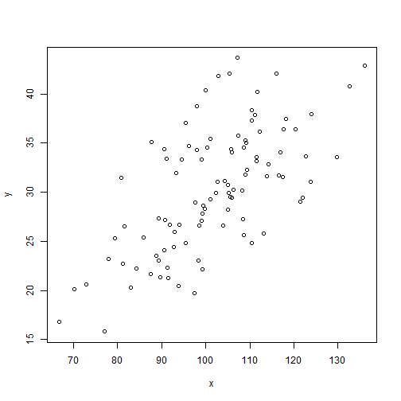 


```r
plot(x, y, main="Customized scatter plot", xlim=c(50, 150), ylim=c(10, 50),
     xlab="x axis", ylab="y axis", pch=16, col="darkgray")
```

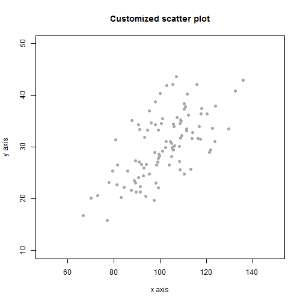 


```r
plot(y, main="Univeriate scatter plot", ylim=c(10, 50),
     xlab="Index", ylab="y axis", pch=4, lwd=2, col="blue")
```

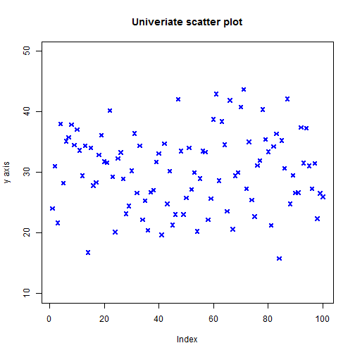 


### Options for specifying $(x, y)$-coordinate pairs


```r
xy <- cbind(x, y)
plot(xy)
plot(y ~ x)
# not shown
```


### Jittering points

Useful if one variable can take on only a few values, and one plot symbol represents many observations.


```r
z <- sample(0:5, N, replace=TRUE)
plot(z ~ x, pch=1, col="red", cex=1.5, main="Scatter plot")
```

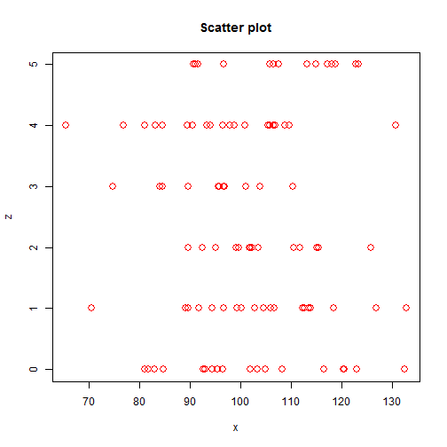 

```r
plot(jitter(z) ~ x, pch=1, col="red", cex=1.5,
     main="Scatter plot with jittered y-coordinate")
```

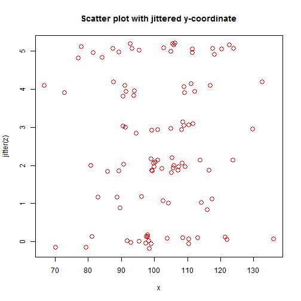 


### Plot types available with `plot()`


```r
vec <- rnorm(10)
plot(vec, type="p", xlab=NA, main="type p", cex=1.5)
```

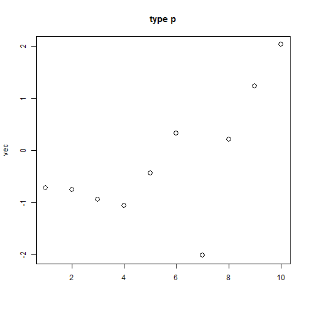 

```r
plot(vec, type="l", xlab=NA, main="type l", cex=1.5)
```

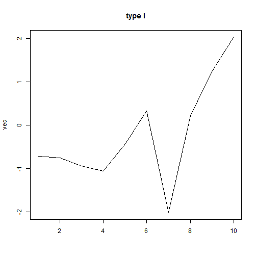 

```r
plot(vec, type="b", xlab=NA, main="type b", cex=1.5)
```

 

```r
plot(vec, type="o", xlab=NA, main="type o", cex=1.5)
```

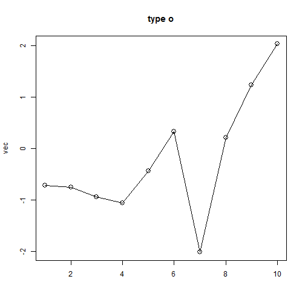 

```r
plot(vec, type="s", xlab=NA, main="type s", cex=1.5)
```

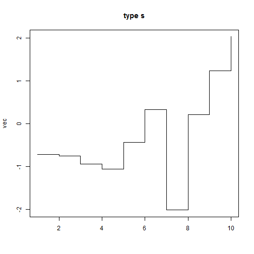 

```r
plot(vec, type="h", xlab=NA, main="type h", cex=1.5)
```

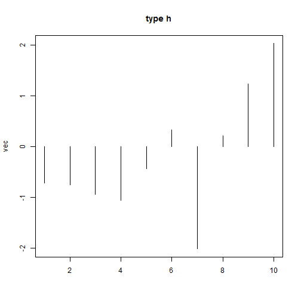 


Simultaneously plot several variable pairs
-------------------------


```r
vec <- seq(from=-2*pi, to=2*pi, length.out=50)
mat <- cbind(2*sin(vec), sin(vec-(pi/4)), 0.5*sin(vec-(pi/2)))
matplot(vec, mat, type="b", xlab=NA, ylab=NA, pch=1:3, main="Sine-curves")
```

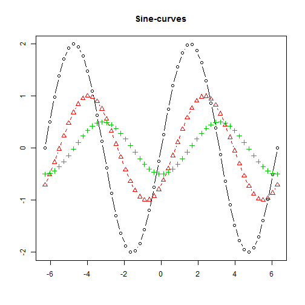 


Identify observations from plot points
-------------------------


```r
plot(vec)
identify(vec)
```


Get the article source from GitHub
----------------------------------------------

[R markdown](https://github.com/dwoll/RExRepos/raw/master/Rmd/diagScatter.Rmd) - [markdown](https://github.com/dwoll/RExRepos/raw/master/md/diagScatter.md) - [R code](https://github.com/dwoll/RExRepos/raw/master/R/diagScatter.R) - [all posts](https://github.com/dwoll/RExRepos/)
