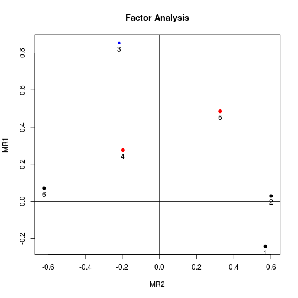
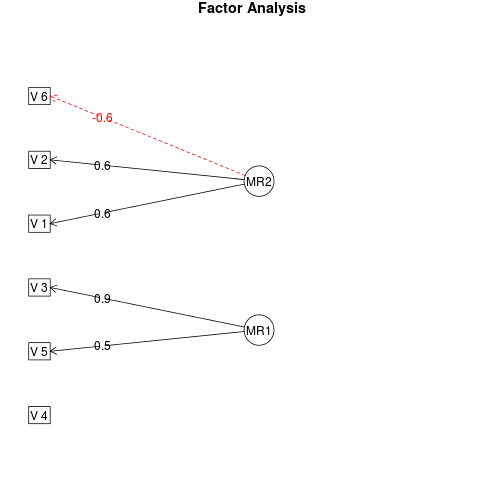
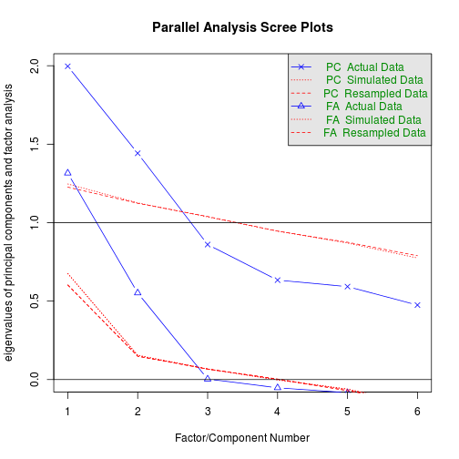

Exploratory factor analysis
=========================

Install required packages
-------------------------

[`GPArotation`](http://cran.r-project.org/package=GPArotation), [`mvtnorm`](http://cran.r-project.org/package=mvtnorm), [`psych`](http://cran.r-project.org/package=psych)


```r
wants <- c("GPArotation", "mvtnorm", "psych")
has   <- wants %in% rownames(installed.packages())
if(any(!has)) install.packages(wants[!has])
```

Factor analysis
-------------------------

### Simulate data

True matrix of loadings


```r
N <- 200
P <- 6
Q <- 2
(Lambda <- matrix(c(0.7,-0.4, 0.8,0, -0.2,0.9, -0.3,0.4, 0.3,0.7, -0.8,0.1),
                  nrow=P, ncol=Q, byrow=TRUE))
```

```
     [,1] [,2]
[1,]  0.7 -0.4
[2,]  0.8  0.0
[3,] -0.2  0.9
[4,] -0.3  0.4
[5,]  0.3  0.7
[6,] -0.8  0.1
```

Non correlated factors


```r
set.seed(123)
library(mvtnorm)
Kf <- diag(Q)
mu <- c(5, 15)
FF <- rmvnorm(N, mean=mu,        sigma=Kf)
E  <- rmvnorm(N, mean=rep(0, P), sigma=diag(P))
X  <- FF %*% t(Lambda) + E
```

### Using `factanal()`


```r
(fa <- factanal(X, factors=2, scores="regression"))
```

```

Call:
factanal(x = X, factors = 2, scores = "regression")

Uniquenesses:
[1] 0.616 0.638 0.225 0.885 0.658 0.608

Loadings:
     Factor1 Factor2
[1,]  0.570  -0.243 
[2,]  0.601         
[3,] -0.217   0.853 
[4,] -0.197   0.276 
[5,]  0.327   0.486 
[6,] -0.622         

               Factor1 Factor2
SS loadings      1.267   1.104
Proportion Var   0.211   0.184
Cumulative Var   0.211   0.395

Test of the hypothesis that 2 factors are sufficient.
The chi square statistic is 1.43 on 4 degrees of freedom.
The p-value is 0.84 
```

### Using `fa()` from package `psych` with rotation

Rotation uses package `GPArotation`


```r
library(psych)
corMat <- cor(X)
(faPC  <- fa(r=corMat, nfactors=2, n.obs=N, rotate="varimax"))
```

```
Factor Analysis using method =  minres
Call: fa(r = corMat, nfactors = 2, n.obs = N, rotate = "varimax")
Standardized loadings (pattern matrix) based upon correlation matrix
    MR2   MR1   h2   u2 com
1  0.57 -0.24 0.38 0.62 1.4
2  0.60  0.03 0.36 0.64 1.0
3 -0.22  0.85 0.77 0.23 1.1
4 -0.20  0.28 0.12 0.88 1.8
5  0.33  0.49 0.34 0.66 1.8
6 -0.62  0.07 0.39 0.61 1.0

                       MR2  MR1
SS loadings           1.27 1.10
Proportion Var        0.21 0.18
Cumulative Var        0.21 0.40
Proportion Explained  0.53 0.47
Cumulative Proportion 0.53 1.00

Mean item complexity =  1.3
Test of the hypothesis that 2 factors are sufficient.

The degrees of freedom for the null model are  15  and the objective function was  0.82 with Chi Square of  160.38
The degrees of freedom for the model are 4  and the objective function was  0.01 

The root mean square of the residuals (RMSR) is  0.02 
The df corrected root mean square of the residuals is  0.03 

The harmonic number of observations is  200 with the empirical chi square  1.37  with prob <  0.85 
The total number of observations was  200  with MLE Chi Square =  1.43  with prob <  0.84 

Tucker Lewis Index of factoring reliability =  1.067
RMSEA index =  0  and the 90 % confidence intervals are  NA 0.061
BIC =  -19.77
Fit based upon off diagonal values = 1
Measures of factor score adequacy             
                                                MR2  MR1
Correlation of scores with factors             0.81 0.88
Multiple R square of scores with factors       0.66 0.78
Minimum correlation of possible factor scores  0.33 0.56
```

Factor scores
-------------------------


```r
bartlett <- fa$scores
head(bartlett)
```

```
         Factor1    Factor2
[1,] -0.14692704 -0.4087124
[2,]  1.12204715 -0.1700198
[3,]  0.06506737  0.7206915
[4,] -0.11231953  0.1411704
[5,] -0.24712181  1.4317221
[6,]  1.09156957  0.3978757
```


```r
anderson <- factor.scores(x=X, f=faPC, method="Anderson")
head(anderson$scores)
```

```
            MR2        MR1
[1,] -0.2024948 -0.4723557
[2,]  1.3725281 -0.1339925
[3,]  0.1181854  0.8226650
[4,] -0.1308349  0.1545395
[5,] -0.2286347  1.6144183
[6,]  1.3650015  0.5099386
```

Visualize loadings
-------------------------


```r
factor.plot(faPC, cut=0.5)
```

 

```r
fa.diagram(faPC)
```

 

Determine number of factors
-------------------------

Parallel analysis and a "very simple structure" analysis provide help in selecting the number of factors. Again, package `psych` has the required functions. `vss()` takes the polychoric correlation matrix as an argument.


```r
fa.parallel(X)                     # parallel analysis
```

 

```
Parallel analysis suggests that the number of factors =  2  and the number of components =  2 
```

```r
vss(X, n.obs=N, rotate="varimax")  # very simple structure
```

 

```

Very Simple Structure
Call: vss(x = X, rotate = "varimax", n.obs = N)
VSS complexity 1 achieves a maximimum of 0.59  with  3  factors
VSS complexity 2 achieves a maximimum of 0.72  with  3  factors

The Velicer MAP achieves a minimum of NA  with  1  factors 
BIC achieves a minimum of  NA  with  2  factors
Sample Size adjusted BIC achieves a minimum of  NA  with  2  factors

Statistics by number of factors 
  vss1 vss2  map dof   chisq    prob sqresid  fit RMSEA BIC SABIC complex
1 0.45 0.00 0.07   9 6.1e+01 8.4e-10     4.3 0.45  0.17  13  41.9     1.0
2 0.57 0.69 0.10   4 1.4e+00 8.4e-01     2.4 0.69  0.00 -20  -7.1     1.3
3 0.59 0.72 0.25   0 4.5e-02      NA     2.0 0.74    NA  NA    NA     1.3
4 0.57 0.72 0.45  -3 9.8e-11      NA     1.6 0.79    NA  NA    NA     1.4
5 0.52 0.67 1.00  -5 1.5e-12      NA     1.5 0.80    NA  NA    NA     1.6
6 0.53 0.67   NA  -6 0.0e+00      NA     1.5 0.81    NA  NA    NA     1.7
   eChisq    SRMR eCRMS eBIC
1 9.8e+01 1.3e-01 0.165   50
2 1.4e+00 1.5e-02 0.029  -20
3 4.3e-02 2.7e-03    NA   NA
4 1.1e-10 1.4e-07    NA   NA
5 1.8e-12 1.7e-08    NA   NA
6 8.2e-27 1.2e-15    NA   NA
```

Useful packages
-------------------------

For confirmatory factor analysis (CFA), see packages [`sem`](http://cran.r-project.org/package=sem), [`OpenMx`](http://openmx.psyc.virginia.edu/), and [`lavaan`](http://cran.r-project.org/package=lavaan) which implement structural equation models. More packages can be found in CRAN task view [Psychometric Models](http://cran.r-project.org/web/views/Psychometrics.html).

Detach (automatically) loaded packages (if possible)
-------------------------


```r
try(detach(package:psych))
try(detach(package:GPArotation))
try(detach(package:mvtnorm))
```

Get the article source from GitHub
----------------------------------------------

[R markdown](https://github.com/dwoll/RExRepos/raw/master/Rmd/multFA.Rmd) - [markdown](https://github.com/dwoll/RExRepos/raw/master/md/multFA.md) - [R code](https://github.com/dwoll/RExRepos/raw/master/R/multFA.R) - [all posts](https://github.com/dwoll/RExRepos/)
