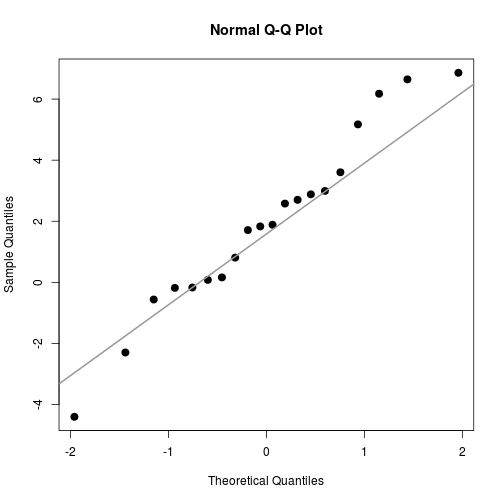

Assess univariate and multivariate normality
=========================

Install required packages
-------------------------

[`energy`](http://cran.r-project.org/package=energy), [`ICS`](http://cran.r-project.org/package=ICS), [`mvtnorm`](http://cran.r-project.org/package=mvtnorm)


```r
wants <- c("energy", "ICS", "mvtnorm")
has   <- wants %in% rownames(installed.packages())
if(any(!has)) install.packages(wants[!has])
```

Univariate normality
-------------------------

### QQ-plot


```r
set.seed(123)
DV <- rnorm(20, mean=1.5, sd=3)
qqnorm(DV, pch=20, cex=2)
qqline(DV, col="gray60", lwd=2)
```

 

### Shapiro-Wilk-test

Composite null hypothesis: any normal distribution


```r
shapiro.test(DV)
```

```

	Shapiro-Wilk normality test

data:  DV
W = 0.9686, p-value = 0.7247
```

### Anderson-Darling-test

Composite null hypothesis: any normal distribution


```r
library(DescTools)
AndersonDarlingTest(DV)
```

```

	Anderson-Darling test of goodness-of-fit
	Null hypothesis: uniform distribution

data:  DV
An = Inf, p-value = 3e-05
```

### Cramer-von-Mises-test

Composite null hypothesis: any normal distribution


```r
library(DescTools)
CramerVonMisesTest(DV)
```

```

	Cramer-von Mises normality test

data:  DV
W = 0.038, p-value = 0.7014
```

### Shapiro-Francia-test

Composite null hypothesis: any normal distribution


```r
library(DescTools)
ShapiroFranciaTest(DV)
```

```

	Shapiro-Francia normality test

data:  DV
W = 0.9701, p-value = 0.6667
```

### Jarque-Bera-test

Composite null hypothesis: any normal distribution


```r
library(DescTools)
JarqueBeraTest(DV)
```

```

	Robust Jarque Bera Test

data:  DV
X-squared = 0.0183, df = 2, p-value = 0.9909
```

### Kolmogorov-Smirnov-test

Exact null hypothesis: fully specified normal distribution


```r
ks.test(DV, "pnorm", mean=1, sd=2, alternative="two.sided")
```

```

	One-sample Kolmogorov-Smirnov test

data:  DV
D = 0.239, p-value = 0.1726
alternative hypothesis: two-sided
```

### Lilliefors-test

Composite null hypothesis: any normal distribution


```r
library(DescTools)
LillieTest(DV)
```

```

	Lilliefors (Kolmogorov-Smirnov) normality test

data:  DV
D = 0.1071, p-value = 0.7925
```

### Pearson $\chi^{2}$-test

Tests weaker null hypothesis (any distribution with the same probabilities for the given class intervals).

Wrong: `pearson.test()` does not use grouped ML-estimate or maximum $\chi^{2}$-estimate


```r
library(DescTools)
PearsonTest(DV, n.classes=6, adjust=TRUE)
```

```

	Pearson chi-square normality test

data:  DV
P = 3.4, p-value = 0.334
```

Multivariate normality
-------------------------

### Energy-test


```r
mu    <- c(2, 4, 5)
Sigma <- matrix(c(4,2,-3, 2,16,-1, -3,-1,9), byrow=TRUE, ncol=3)
library(mvtnorm)
X <- rmvnorm(100, mu, Sigma)
```


```r
library(energy)                    # for mvnorm.etest()
mvnorm.etest(X)
```

```

	Energy test of multivariate normality: estimated parameters

data:  x, sample size 100, dimension 3, replicates 999
E-statistic = 1.109, p-value = 0.03704
```

### Kurtosis- and skew-test

#### Kurtosis-test


```r
library(ICS)
mvnorm.kur.test(X)
```

```

	Multivariate Normality Test Based on Kurtosis

data:  X
W = 11.0848, w1 = 1.12, df1 = 5.00, w2 = 1.60, df2 = 1.00, p-value
= 0.1613
```

#### Skew-test

```r
library(ICS)
X <- rmvnorm(100, c(2, 4, 5))
mvnorm.skew.test(X)
```

```

	Multivariate Normality Test Based on Skewness

data:  X
U = 2.6575, df = 3, p-value = 0.4475
```

Detach (automatically) loaded packages (if possible)
-------------------------


```r
try(detach(package:DescTools))
try(detach(package:energy))
try(detach(package:ICS))
try(detach(package:mvtnorm))
try(detach(package:survey))
try(detach(package:CompQuadForm))
```

Get the article source from GitHub
----------------------------------------------

[R markdown](https://github.com/dwoll/RExRepos/raw/master/Rmd/normality.Rmd) - [markdown](https://github.com/dwoll/RExRepos/raw/master/md/normality.md) - [R code](https://github.com/dwoll/RExRepos/raw/master/R/normality.R) - [all posts](https://github.com/dwoll/RExRepos/)
