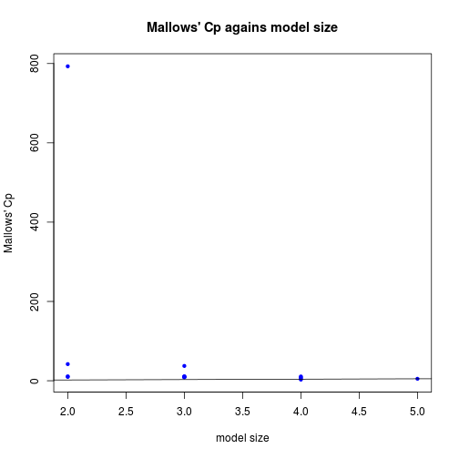
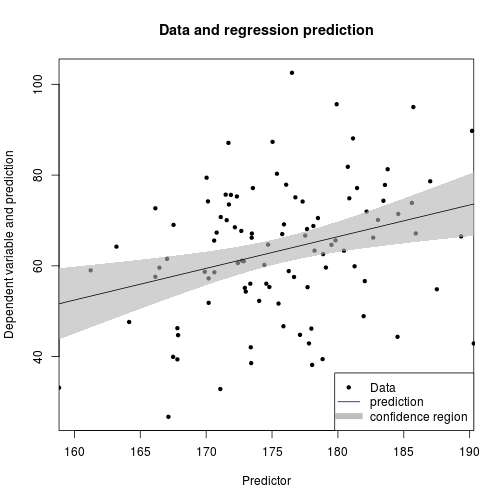

Multiple linear regression
=========================


TODO
-------------------------

 - link to regressionDiag, regressionModMed, crossvalidation, resamplingBootALM

Install required packages
-------------------------

[`car`](http://cran.r-project.org/package=car), [`leaps`](http://cran.r-project.org/package=leaps), [`lmtest`](http://cran.r-project.org/package=lmtest), [`sandwich`](http://cran.r-project.org/package=sandwich)


```r
wants <- c("car", "leaps", "lmtest", "sandwich")
has   <- wants %in% rownames(installed.packages())
if(any(!has)) install.packages(wants[!has])
```

Descriptive model fit
-------------------------

### Descriptive model fit


```r
set.seed(123)
N  <- 100
X1 <- rnorm(N, 175, 7)
X2 <- rnorm(N,  30, 8)
X3 <- abs(rnorm(N, 60, 30))
Y  <- 0.5*X1 - 0.3*X2 - 0.4*X3 + 10 + rnorm(N, 0, 7)
dfRegr <- data.frame(X1, X2, X3, Y)
```


```r
(fit12 <- lm(Y ~ X1 + X2, data=dfRegr))
```

```

Call:
lm(formula = Y ~ X1 + X2, data = dfRegr)

Coefficients:
(Intercept)           X1           X2  
   -47.5012       0.6805      -0.2965  
```

```r
lm(scale(Y) ~ scale(X1) + scale(X2), data=dfRegr)
```

```

Call:
lm(formula = scale(Y) ~ scale(X1) + scale(X2), data = dfRegr)

Coefficients:
(Intercept)    scale(X1)    scale(X2)  
  5.053e-16    2.972e-01   -1.568e-01  
```


```r
library(car)
scatter3d(Y ~ X1 + X2, fill=FALSE, data=dfRegr)
```

 

### Estimated coefficients, residuals, and fitted values


```r
coef(fit12)
```

```
(Intercept)          X1          X2 
-47.5011799   0.6804857  -0.2964717 
```

```r
E <- residuals(fit12)
head(E)
```

```
         1          2          3          4          5          6 
-28.853937 -18.923898  -3.540015 -12.154867   3.585806   7.677999 
```

```r
Yhat <- fitted(fit12)
head(Yhat)
```

```
       1        2        3        4        5        6 
61.70483 60.98398 70.69952 63.84983 65.56255 70.96601 
```

### Add and remove predictors


```r
(fit123 <- update(fit12,  . ~ . + X3))
```

```

Call:
lm(formula = Y ~ X1 + X2 + X3, data = dfRegr)

Coefficients:
(Intercept)           X1           X2           X3  
    19.1588       0.4445      -0.2596      -0.4134  
```

```r
(fit13 <- update(fit123, . ~ . - X1))
```

```

Call:
lm(formula = Y ~ X2 + X3, data = dfRegr)

Coefficients:
(Intercept)           X2           X3  
    98.5347      -0.2763      -0.4261  
```

```r
(fit1 <- update(fit12,  . ~ . - X2))
```

```

Call:
lm(formula = Y ~ X1, data = dfRegr)

Coefficients:
(Intercept)           X1  
   -59.2628       0.6983  
```

Assessing model fit
-------------------------

### (Adjusted) $R^{2}$ and residual standard error


```r
sumRes <- summary(fit123)
sumRes$r.squared
```

```
[1] 0.7545767
```

```r
sumRes$adj.r.squared
```

```
[1] 0.7469072
```

```r
sumRes$sigma
```

```
[1] 7.360588
```

### Information criteria AIC and BIC


```r
AIC(fit1)
```

```
[1] 815.6499
```

```r
extractAIC(fit1)
```

```
[1]   2.0000 529.8622
```

```r
extractAIC(fit1, k=log(N))
```

```
[1]   2.0000 535.0725
```

### Crossvalidation

`cv.glm()` function from package `boot`, see crossvalidation

Coefficient tests and overall model test
-------------------------


```r
summary(fit12)
```

```

Call:
lm(formula = Y ~ X1 + X2, data = dfRegr)

Residuals:
    Min      1Q  Median      3Q     Max 
-31.857  -6.765   1.967   9.270  37.943 

Coefficients:
            Estimate Std. Error t value Pr(>|t|)   
(Intercept) -47.5012    39.0472  -1.217  0.22674   
X1            0.6805     0.2187   3.112  0.00244 **
X2           -0.2965     0.1806  -1.641  0.10395   
---
Signif. codes:  0 '***' 0.001 '**' 0.01 '*' 0.05 '.' 0.1 ' ' 1

Residual standard error: 13.89 on 97 degrees of freedom
Multiple R-squared:  0.1175,	Adjusted R-squared:  0.09931 
F-statistic: 6.458 on 2 and 97 DF,  p-value: 0.002328
```

```r
confint(fit12)
```

```
                   2.5 %      97.5 %
(Intercept) -124.9990783 29.99671860
X1             0.2464808  1.11449071
X2            -0.6549521  0.06200877
```

```r
vcov(fit12)
```

```
            (Intercept)           X1           X2
(Intercept) 1524.684429 -8.455382007 -1.294237738
X1            -8.455382  0.047817791  0.001956354
X2            -1.294238  0.001956354  0.032623539
```

Variable selection and model comparisons
-------------------------

### Model comparisons

#### Effect of adding a single predictor


```r
add1(fit1, . ~ . + X2 + X3, test="F")
```

```
Single term additions

Model:
Y ~ X1
       Df Sum of Sq   RSS    AIC  F value Pr(>F)    
<none>              19222 529.86                    
X2      1     519.5 18702 529.12   2.6942  0.104    
X3      1   13622.6  5599 408.52 236.0033 <2e-16 ***
---
Signif. codes:  0 '***' 0.001 '**' 0.01 '*' 0.05 '.' 0.1 ' ' 1
```

#### Effect of adding several predictors


```r
anova(fit1, fit123)
```

```
Analysis of Variance Table

Model 1: Y ~ X1
Model 2: Y ~ X1 + X2 + X3
  Res.Df     RSS Df Sum of Sq      F    Pr(>F)    
1     98 19221.6                                  
2     96  5201.1  2     14020 129.39 < 2.2e-16 ***
---
Signif. codes:  0 '***' 0.001 '**' 0.01 '*' 0.05 '.' 0.1 ' ' 1
```

### All predictor subsets


```r
data(longley)
head(longley)
```

```
     GNP.deflator     GNP Unemployed Armed.Forces Population Year Employed
1947         83.0 234.289      235.6        159.0    107.608 1947   60.323
1948         88.5 259.426      232.5        145.6    108.632 1948   61.122
1949         88.2 258.054      368.2        161.6    109.773 1949   60.171
1950         89.5 284.599      335.1        165.0    110.929 1950   61.187
1951         96.2 328.975      209.9        309.9    112.075 1951   63.221
1952         98.1 346.999      193.2        359.4    113.270 1952   63.639
```

```r
library(leaps)
subs <- regsubsets(GNP.deflator ~ ., data=longley)
summary(subs, matrix.logical=TRUE)
```

```
Subset selection object
Call: dwKnit(inputFile, outputFile, markdEngine, siteGen)
6 Variables  (and intercept)
             Forced in Forced out
GNP              FALSE      FALSE
Unemployed       FALSE      FALSE
Armed.Forces     FALSE      FALSE
Population       FALSE      FALSE
Year             FALSE      FALSE
Employed         FALSE      FALSE
1 subsets of each size up to 6
Selection Algorithm: exhaustive
           GNP Unemployed Armed.Forces Population  Year Employed
1  ( 1 )  TRUE      FALSE        FALSE      FALSE FALSE    FALSE
2  ( 1 ) FALSE      FALSE         TRUE      FALSE  TRUE    FALSE
3  ( 1 )  TRUE       TRUE        FALSE       TRUE FALSE    FALSE
4  ( 1 )  TRUE       TRUE         TRUE       TRUE FALSE    FALSE
5  ( 1 )  TRUE       TRUE         TRUE       TRUE  TRUE    FALSE
6  ( 1 )  TRUE       TRUE         TRUE       TRUE  TRUE     TRUE
```

```r
plot(subs, scale="bic")
```

 


```r
Xmat <- data.matrix(subset(longley, select=c("GNP", "Unemployed", "Population", "Year")))
(leapFits <- leaps(Xmat, longley$GNP.deflator, method="Cp"))
```

```
$which
      1     2     3     4
1  TRUE FALSE FALSE FALSE
1 FALSE FALSE FALSE  TRUE
1 FALSE FALSE  TRUE FALSE
1 FALSE  TRUE FALSE FALSE
2 FALSE  TRUE FALSE  TRUE
2 FALSE FALSE  TRUE  TRUE
2  TRUE FALSE FALSE  TRUE
2  TRUE FALSE  TRUE FALSE
2  TRUE  TRUE FALSE FALSE
2 FALSE  TRUE  TRUE FALSE
3  TRUE  TRUE  TRUE FALSE
3  TRUE FALSE  TRUE  TRUE
3 FALSE  TRUE  TRUE  TRUE
3  TRUE  TRUE FALSE  TRUE
4  TRUE  TRUE  TRUE  TRUE

$label
[1] "(Intercept)" "1"           "2"           "3"           "4"          

$size
 [1] 2 2 2 2 3 3 3 3 3 3 4 4 4 4 5

$Cp
 [1]   9.934664  11.077014  42.000853 793.075625   8.960981   9.177695
 [7]   9.430473  10.982967  10.985247  37.402418   3.000512   5.963360
[13]   8.781825  10.821894   5.000000
```


```r
plot(leapFits$size, leapFits$Cp, xlab="model size", pch=20, col="blue",
     ylab="Mallows' Cp", main="Mallows' Cp agains model size")
abline(a=0, b=1)
```

 

Apply regression model to new data
-------------------------


```r
X1new <- c(177, 150, 192, 189, 181)
dfNew <- data.frame(X1=X1new)
predict(fit1, dfNew, interval="prediction", level=0.95)
```

```
       fit      lwr       upr
1 64.33003 36.39261  92.26744
2 45.47689 15.38202  75.57176
3 74.80400 45.97114 103.63686
4 72.70920 44.17348 101.24492
5 67.12309 39.09370  95.15248
```

```r
predOrg <- predict(fit1, interval="confidence", level=0.95)
```


```r
hOrd <- order(X1)
par(lend=2)
plot(X1, Y, pch=20, xlab="Predictor", ylab="Dependent variable and prediction",
     xaxs="i", main="Data and regression prediction")

polygon(c(X1[hOrd],             X1[rev(hOrd)]),
        c(predOrg[hOrd, "lwr"], predOrg[rev(hOrd), "upr"]),
        border=NA, col=rgb(0.7, 0.7, 0.7, 0.6))

abline(fit1, col="black")
legend(x="bottomright", legend=c("Data", "prediction", "confidence region"),
       pch=c(20, NA, NA), lty=c(NA, 1, 1), lwd=c(NA, 1, 8),
       col=c("black", "blue", "gray"))
```

 

Detach (automatically) loaded packages (if possible)
-------------------------


```r
try(detach(package:leaps))
try(detach(package:lmtest))
try(detach(package:sandwich))
try(detach(package:zoo))
try(detach(package:car))
```

Get the article source from GitHub
----------------------------------------------

[R markdown](https://github.com/dwoll/RExRepos/raw/master/Rmd/regression.Rmd) - [markdown](https://github.com/dwoll/RExRepos/raw/master/md/regression.md) - [R code](https://github.com/dwoll/RExRepos/raw/master/R/regression.R) - [all posts](https://github.com/dwoll/RExRepos/)
