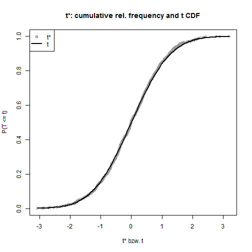

TODO
-------------------------

 - link to resamplingBootALM

Install required packages
-------------------------

[`boot`](http://cran.r-project.org/package=boot)


```r
wants <- c("boot")
has   <- wants %in% rownames(installed.packages())
if(any(!has)) install.packages(wants[!has])
```


Confidence interval for $\mu$
-------------------------

### Using package `boot`
    

```r
set.seed(1.234)
muH0 <- 100
sdH0 <- 40
N    <- 200
DV   <- rnorm(N, muH0, sdH0)
```


Function to calculate the mean and uncorrected variance (=plug-in estimator for the population variance) of a given replication.


```r
getM <- function(orgDV, idx) {
    n     <- length(orgDV[idx])
    bsM   <- mean(orgDV[idx])
    bsS2M <- (((n-1) / n) * var(orgDV[idx])) / n
    c(bsM, bsS2M)
}

library(boot)
nR     <- 999
(bsRes <- boot(DV, statistic=getM, R=nR))
```

```

ORDINARY NONPARAMETRIC BOOTSTRAP


Call:
boot(data = DV, statistic = getM, R = nR)


Bootstrap Statistics :
    original   bias    std. error
t1*  101.422 -0.11027      2.6829
t2*    6.871 -0.04513      0.6576
```


Various types of bootstrap confidence intervals


```r
alpha <- 0.05
boot.ci(bsRes, conf=1-alpha, type=c("basic", "perc", "norm", "stud", "bca"))
```

```
BOOTSTRAP CONFIDENCE INTERVAL CALCULATIONS
Based on 999 bootstrap replicates

CALL : 
boot.ci(boot.out = bsRes, conf = 1 - alpha, type = c("basic", 
    "perc", "norm", "stud", "bca"))

Intervals : 
Level      Normal              Basic             Studentized     
95%   ( 96.3, 106.8 )   ( 96.2, 106.9 )   ( 96.1, 107.0 )  

Level     Percentile            BCa          
95%   ( 96.0, 106.7 )   ( 96.0, 106.7 )  
Calculations and Intervals on Original Scale
```


### Bootstrap distribution

For the $t$ test statistic, compare the empirical distribution from the bootstrap replicates against the theoretical $t_{n-1}$ distribtion.


```r
res    <- replicate(nR, getM(DV, sample(seq(along=DV), replace=TRUE)))
Mstar  <- res[1, ]
SMstar <- sqrt(res[2, ])
tStar  <- (Mstar-mean(DV)) / SMstar
```


```r
plot(tStar, ecdf(tStar)(tStar), col="gray60", pch=1, xlab="t* bzw. t",
     ylab="P(T <= t)", main="t*: cumulative rel. frequency and t CDF")
curve(pt(x, N-1), lwd=2, add=TRUE)
legend(x="topleft", lty=c(NA, 1), pch=c(1, NA), lwd=c(2, 2),
       col=c("gray60", "black"), legend=c("t*", "t"))
```

 


Detach (automatically) loaded packages (if possible)
-------------------------


```r
try(detach(package:boot))
```


Get the article source from GitHub
----------------------------------------------

[R markdown](https://github.com/dwoll/RExRepos/raw/master/Rmd/resamplingBoot.Rmd) - [markdown](https://github.com/dwoll/RExRepos/raw/master/md/resamplingBoot.md) - [R code](https://github.com/dwoll/RExRepos/raw/master/R/resamplingBoot.R) - [all posts](https://github.com/dwoll/RExRepos/)
