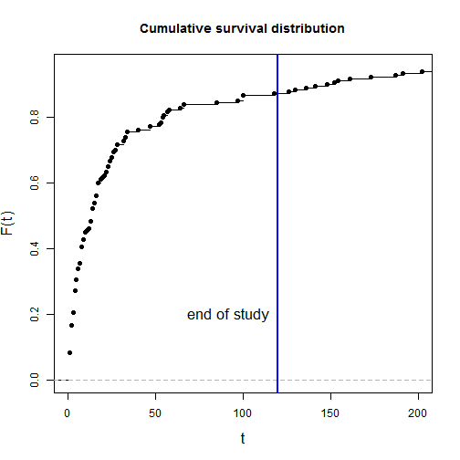
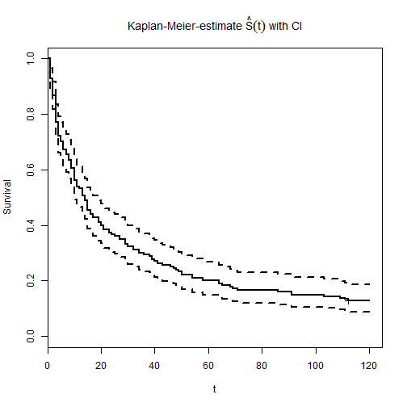
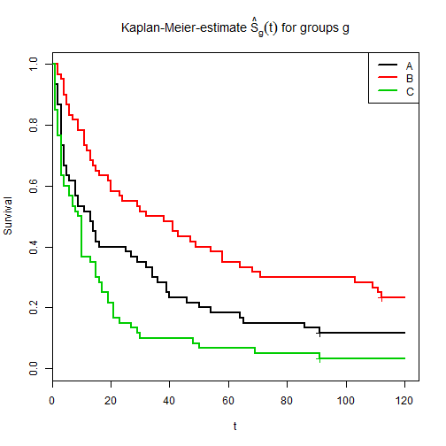

TODO
-------------------------

 - link to survivalCoxPH, survivalParametric

Install required packages
-------------------------

[`survival`](http://cran.r-project.org/package=survival)


```r
wants <- c("survival")
has   <- wants %in% rownames(installed.packages())
if(any(!has)) install.packages(wants[!has])
```


Simulated right-censored event times with Weibull distribution
-------------------------

Simulated survival time $T$ influenced by time independent covariates $X_{j}$ with effect parameters $\beta_{j}$ under assumption of proportional hazards, stratified by sex.

$T = (-\ln(U) \, b \, e^{-\bf{X} \bf{\beta}})^{\frac{1}{a}}$, where $U \sim \mathcal{U}(0, 1)$, $a$ is the Weibull shape parameter and $b$ is the Weibull scale parameter.


```r
set.seed(1.234)
N      <- 180                  # number of observations
P      <- 3                    # number of groups
sex    <- factor(sample(c("f", "m"), N, replace=TRUE))  # stratification factor
X      <- rnorm(N, 0, 1)       # continuous covariate
IV     <- factor(rep(LETTERS[1:P], each=N/P))  # factor covariate
IVeff  <- c(0, -1, 1.5)        # effects of factor levels (1 -> reference level)
Xbeta  <- 0.7*X + IVeff[unclass(IV)] + rnorm(N, 0, 2)
weibA  <- 1.5                  # Weibull shape parameter
weibB  <- 100                  # Weibull scale parameter
U      <- runif(N, 0, 1)       # uniformly distributed RV
eventT <- ceiling((-log(U)*weibB*exp(-Xbeta))^(1/weibA))   # simulated event time

# censoring due to study end after 120 days
obsLen <- 120                  # length of observation time
censT  <- rep(obsLen, N)       # censoring time = end of study
obsT   <- pmin(eventT, censT)  # observed censored event times
status <- eventT <= censT      # has event occured?
dfSurv <- data.frame(obsT, status, sex, X, IV)          # data frame
```


Plot simulated data


```r
plot(ecdf(eventT), xlim=c(0, 200), main="Cumulative survival distribution",
     xlab="t", ylab="F(t)", cex.lab=1.4)
abline(v=obsLen, col="blue", lwd=2)
text(obsLen-5, 0.2, adj=1, labels="end of study", cex=1.4)
```

 


Kaplan-Meier-Analysis
-------------------------

### Estimate survival-function

Survival function $S(t) = 1-F(t)$, hazard function

$$
\begin{equation*}
\lambda(t) = \lim_{\Delta_{t} \to 0^{+}} \frac{P(t \leq T < t + \Delta_{t} \, | \, T \geq t)}{\Delta_{t}} = \frac{P(t \leq T < t + \Delta_{t}) / \Delta_{t}}{P(T > t)} = \frac{f(t)}{S(t)}, \quad t \geq 0
\end{equation*}
$$


```r
library(survival)                # for Surv(), survfit()
## global estimate
KM0 <- survfit(Surv(obsT, status) ~ 1,  type="kaplan-meier", conf.type="log", data=dfSurv)

## separate estimate for all strata
(KM <- survfit(Surv(obsT, status) ~ IV, type="kaplan-meier", conf.type="log", data=dfSurv))
```

```
Call: survfit(formula = Surv(obsT, status) ~ IV, data = dfSurv, type = "kaplan-meier", 
    conf.type = "log")

     records n.max n.start events median 0.95LCL 0.95UCL
IV=A      60    60      60     56   13.0       9      19
IV=B      60    60      60     44   24.5      15      55
IV=C      60    60      60     57    8.0       4      15
```


Arbitrary quantiles for estimated survival function.


```r
## survival 2.37-2 has a bug in quantile(), so this currently doesn't work
# quantile(KM0, probs = c(0.25, 0.5, 0.75), conf.int=FALSE)
```


All estimated values for survival function including point-wise confidence interval.


```r
summary(KM0)
```

```
Call: survfit(formula = Surv(obsT, status) ~ 1, data = dfSurv, type = "kaplan-meier", 
    conf.type = "log")

 time n.risk n.event survival std.err lower 95% CI upper 95% CI
    1    180      15    0.917  0.0206       0.8772        0.958
    2    165      15    0.833  0.0278       0.7806        0.890
    3    150       7    0.794  0.0301       0.7375        0.856
    4    143      12    0.728  0.0332       0.6656        0.796
    5    131       6    0.694  0.0343       0.6303        0.765
    6    125       6    0.661  0.0353       0.5955        0.734
    7    119       3    0.644  0.0357       0.5782        0.718
    8    116       9    0.594  0.0366       0.5269        0.671
    9    107       4    0.572  0.0369       0.5043        0.649
   10    103       4    0.550  0.0371       0.4819        0.628
   11     99       1    0.544  0.0371       0.4763        0.622
   12     98       1    0.539  0.0372       0.4708        0.617
   13     97       4    0.517  0.0372       0.4486        0.595
   14     93       7    0.478  0.0372       0.4101        0.557
   15     86       3    0.461  0.0372       0.3937        0.540
   16     83       4    0.439  0.0370       0.3721        0.518
   17     79       7    0.400  0.0365       0.3345        0.478
   19     72       2    0.389  0.0363       0.3238        0.467
   20     70       1    0.383  0.0362       0.3185        0.461
   21     69       1    0.378  0.0361       0.3132        0.456
   22     68       2    0.367  0.0359       0.3026        0.444
   23     66       3    0.350  0.0356       0.2868        0.427
   24     63       3    0.333  0.0351       0.2711        0.410
   25     60       2    0.322  0.0348       0.2607        0.398
   26     58       3    0.306  0.0343       0.2452        0.381
   27     55       1    0.300  0.0342       0.2400        0.375
   28     54       3    0.283  0.0336       0.2246        0.357
   32     51       2    0.272  0.0332       0.2144        0.346
   33     49       2    0.261  0.0327       0.2042        0.334
   34     47       3    0.244  0.0320       0.1891        0.316
   40     44       1    0.239  0.0318       0.1841        0.310
   47     43       2    0.228  0.0313       0.1741        0.298
   52     41       1    0.222  0.0310       0.1691        0.292
   53     40       1    0.217  0.0307       0.1641        0.286
   54     39       3    0.200  0.0298       0.1493        0.268
   55     36       1    0.194  0.0295       0.1444        0.262
   57     35       2    0.183  0.0288       0.1347        0.250
   58     33       1    0.178  0.0285       0.1298        0.243
   64     32       1    0.172  0.0281       0.1250        0.237
   66     31       2    0.161  0.0274       0.1154        0.225
   85     29       1    0.156  0.0270       0.1107        0.219
   97     28       1    0.150  0.0266       0.1059        0.212
  100     27       3    0.133  0.0253       0.0919        0.194
  118     24       1    0.128  0.0249       0.0872        0.187
```


### Plot estimated survival function

Global estimate including pointwise confidence intervals.


```r
plot(KM0, main=expression(paste("Kaplan-Meier-estimate ", hat(S)(t), " with CI")),
     xlab="t", ylab="Survival", lwd=2)
```

 


Separate estimates for levels of factor `IV`


```r
plot(KM, main=expression(paste("Kaplan-Meier-estimate ", hat(S)[g](t), " for groups g")),
     xlab="t", ylab="Survival", lwd=2, col=1:3)
legend(x="topright", col=1:3, lwd=2, legend=LETTERS[1:3])
```

 


### Plot cumulative hazard

$\hat{\Lambda}(t)$


```r
plot(KM0, main=expression(paste("Kaplan-Meier-estimate ", hat(Lambda)(t))),
     xlab="t", ylab="cumulative hazard", fun="cumhaz", lwd=2)
```

 


### Log-rank-test for equal survival-functions

Global test


```r
survdiff(Surv(obsT, status) ~ IV, data=dfSurv)
```

```
Call:
survdiff(formula = Surv(obsT, status) ~ IV, data = dfSurv)

      N Observed Expected (O-E)^2/E (O-E)^2/V
IV=A 60       56     50.7     0.552     0.861
IV=B 60       44     68.4     8.694    16.814
IV=C 60       57     37.9     9.613    13.798

 Chisq= 20.8  on 2 degrees of freedom, p= 3.05e-05 
```


Stratified for factor `sex`


```r
survdiff(Surv(obsT, status) ~ IV + strata(sex), data=dfSurv)
```

```
Call:
survdiff(formula = Surv(obsT, status) ~ IV + strata(sex), data = dfSurv)

      N Observed Expected (O-E)^2/E (O-E)^2/V
IV=A 60       56     50.7     0.549     0.856
IV=B 60       44     68.6     8.824    17.160
IV=C 60       57     37.7     9.913    14.284

 Chisq= 21.4  on 2 degrees of freedom, p= 2.27e-05 
```


Detach (automatically) loaded packages (if possible)
-------------------------


```r
try(detach(package:survival))
try(detach(package:splines))
```


Get the article source from GitHub
----------------------------------------------

[R markdown](https://github.com/dwoll/RExRepos/raw/master/Rmd/survivalKM.Rmd) - [markdown](https://github.com/dwoll/RExRepos/raw/master/md/survivalKM.md) - [R code](https://github.com/dwoll/RExRepos/raw/master/R/survivalKM.R) - [all posts](https://github.com/dwoll/RExRepos/)
